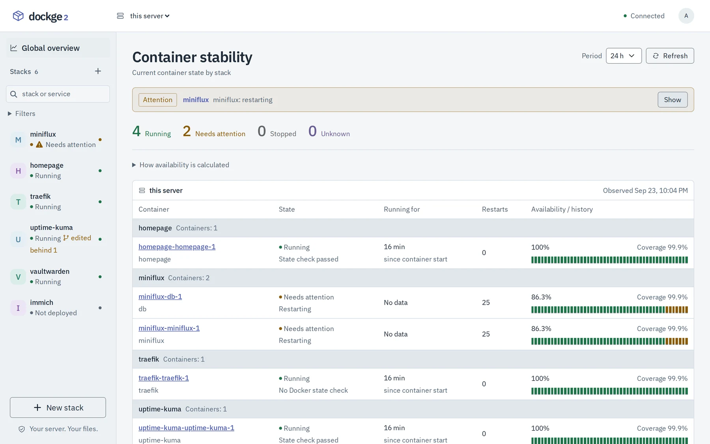
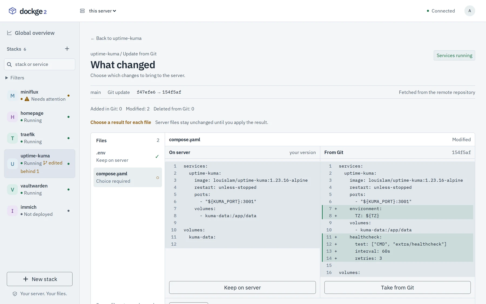
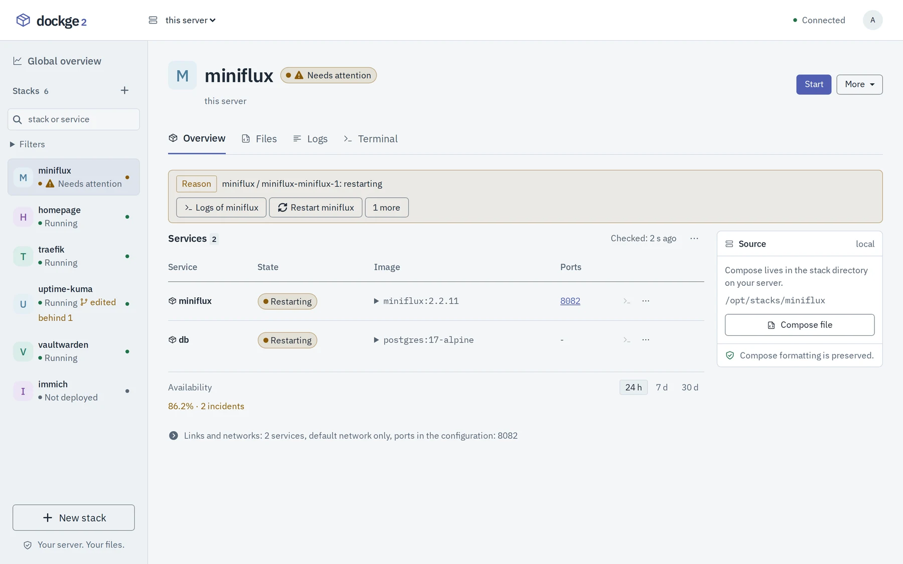
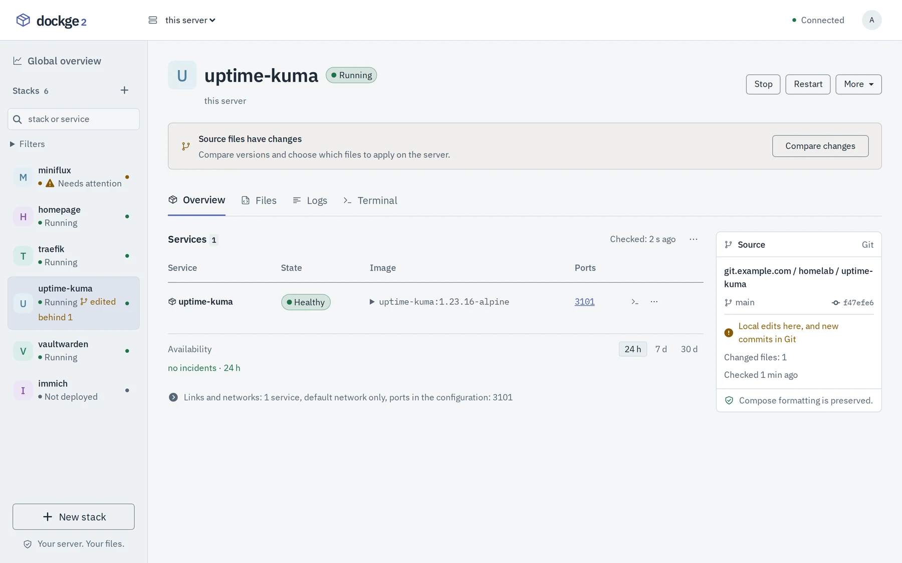
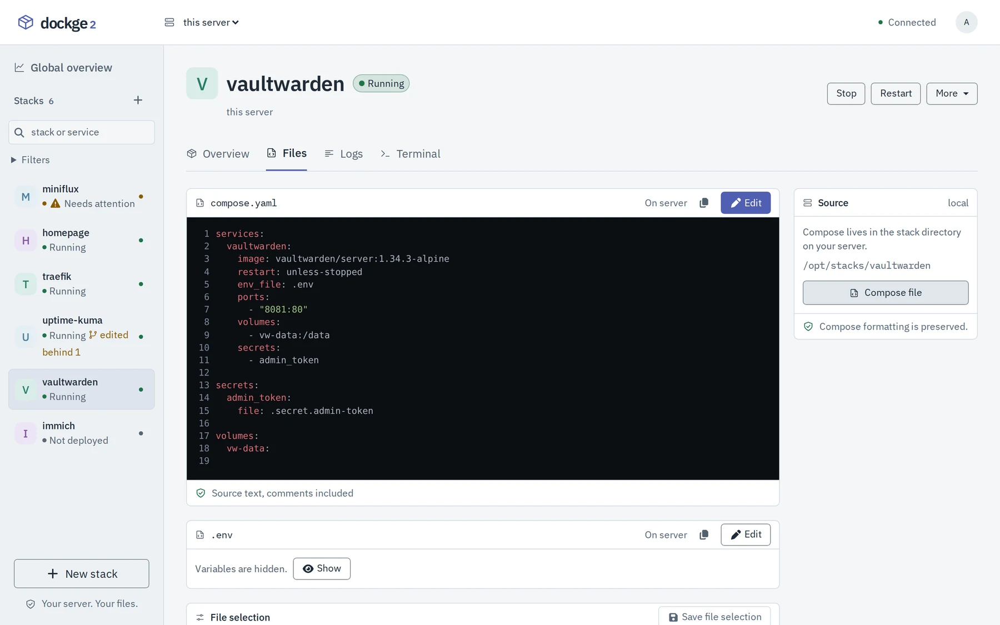
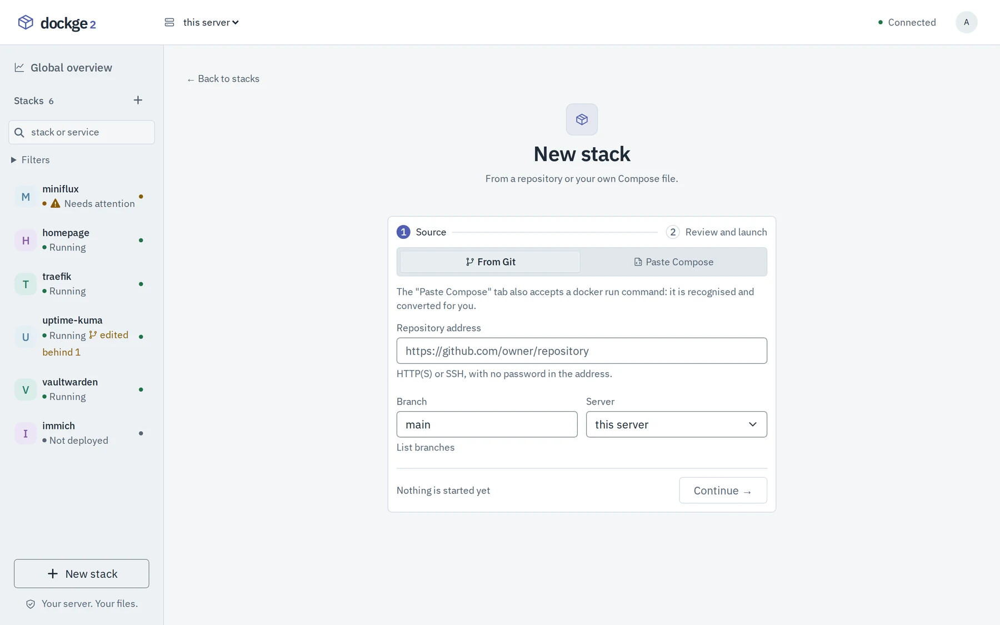
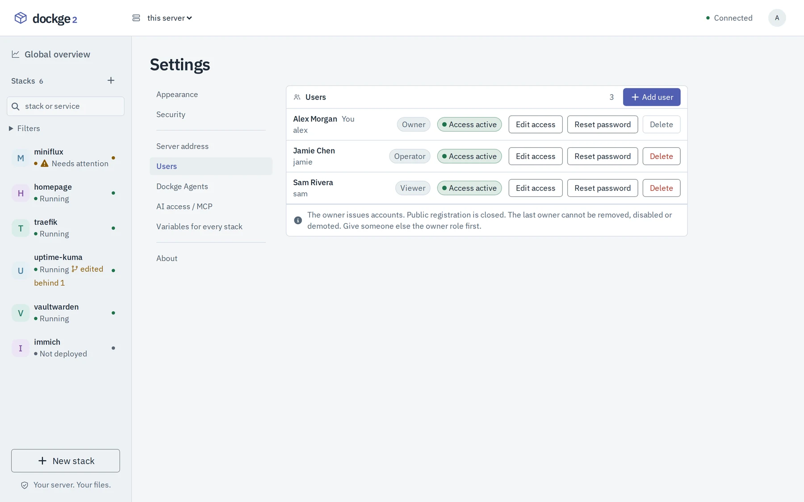
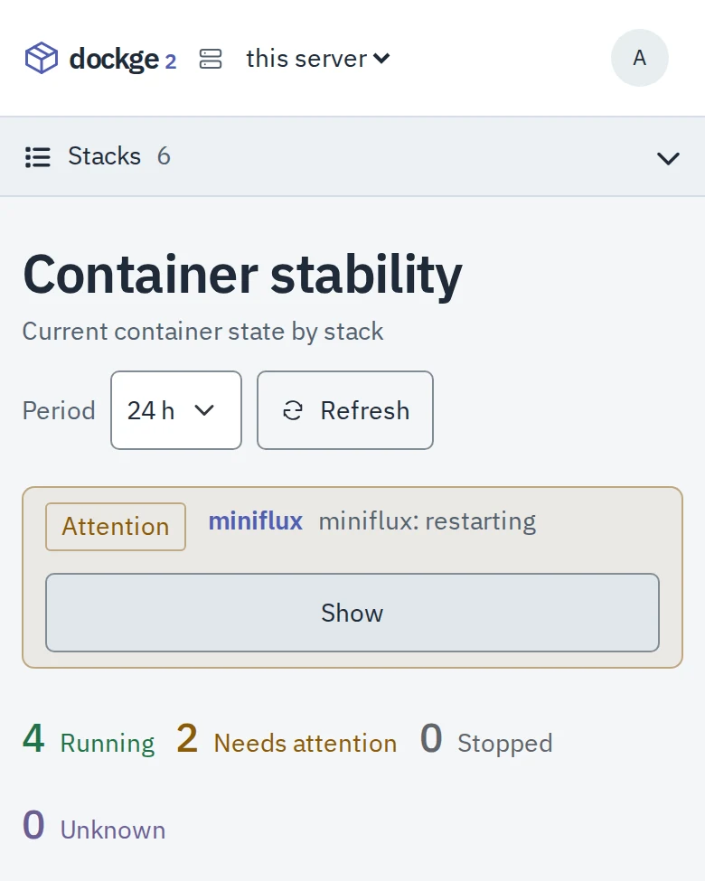
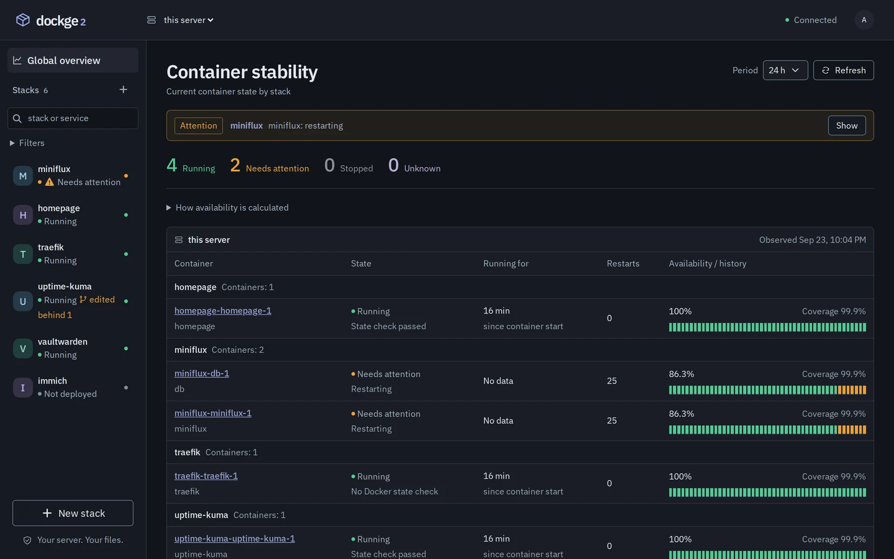

<div align="center">
    
    <h1>Dockge2</h1>
    <p>A self-hosted manager for Docker Compose stacks.<br />Your compose files stay files on your disk.</p>

[](https://github.com/mazixs/dockge2/releases)
[](https://github.com/mazixs/dockge2/actions/workflows/ci.yml)
[](LICENSE)
[](https://github.com/mazixs/dockge2/commits/main/)

</div>

<picture>
    <source media="(prefers-color-scheme: dark)" srcset="docs/assets/screenshots/dashboard-dark.webp" />
    
</picture>

Dockge2 runs next to your stacks and answers three questions on the first screen: what is running,
what needs attention, and how to open or add a stack. A stack is a directory with a `compose.yaml`;
the panel reads and runs it, and `docker compose` keeps working on the same directory without it.

- Start, stop, restart and update stacks, read their logs, open a terminal in a container.
- Edit Compose as text or structurally, without losing comments or formatting; paste a
  `docker run` command to turn it into a stack.
- Deploy a stack from a Git repository and update it file by file.
- Accounts for the people who share the server, with roles and two-factor authentication.
- Uptime and availability of every container over 24 hours, 7 and 30 days.
- Several Docker hosts in one interface, through agents.

Dockge2 is a fork of [Dockge](https://github.com/louislam/dockge) by Louis Lam. It is not a drop-in
replacement, and issues of this fork belong [here](https://github.com/mazixs/dockge2/issues), not
upstream.

## What changed from Dockge

- **Accounts and roles.** The owner issues accounts with the owner, operator or viewer role; there
  is no public signup, and the first owner is created with a one-use code read on the server.
  Two-factor authentication, sessions in an `httpOnly` cookie, and access checked on the server for
  every request, agents included. A viewer sees states, never files, secrets, logs or terminals.
- **Status that does not guess.** Stack state is computed from the containers themselves and fails
  closed: running, stopped, failed, unknown and needs attention are told apart, and a stack that
  needs attention names the container, the reason and the next step.
- **Availability history.** Every container's state is recorded, so uptime and availability come
  from what was observed. Without a fresh observation the figures say "unknown" instead of
  assuming the best.
- **Stacks from Git.** Clone a stack from a repository, see how far its branch has moved, compare
  each changed file with the server copy and choose which version to keep before anything is
  written or deployed.
- **Your files stay yours.** Structured edits keep comments, order, quoting and anchors, and saving
  without an edit writes the same bytes. A stack can use several Compose and env files. Secrets are
  files with `0600` permissions, and revealing one asks for the password again.
- **Signed releases and a host updater.** The installer and the updater verify signatures, pull the
  image by digest and snapshot the panel data first, so a failed update can go back to the previous
  release. Nothing is built on the server.
- **MCP access for AI clients**, off by default: individual expiring keys scoped to servers and
  stacks, with changes prepared and applied in two steps.
- **A rewritten interface**, screen by screen, for keyboard use and narrow screens. English and
  Russian are complete; the language menu shows only complete translations.
- **Upstream fixes included**: path traversal ([#994](https://github.com/louislam/dockge/issues/994)),
  saving `.env` ([#964](https://github.com/louislam/dockge/issues/964)), init containers
  ([#806](https://github.com/louislam/dockge/issues/806)) and `tmpfs` modes
  ([#990](https://github.com/louislam/dockge/issues/990)).

Version numbers are this fork's own and started again at 0.0.1.

<table>
    <tr>
        <td width="50%"></td>
        <td width="50%"></td>
    </tr>
    <tr>
        <td>An update from Git: each file compared, each result chosen.</td>
        <td>A stack that needs attention says why, and what to do next.</td>
    </tr>
</table>

## Install

On a Linux host (amd64 or arm64) with Docker Engine 24+ and Docker Compose 2.20+, download the
installer of the latest release, read it, preview and install:

```bash
curl --proto '=https' --proto-redir '=https' -fsSL \
  https://github.com/mazixs/dockge2/releases/latest/download/install.sh -o /tmp/dockge2-install.sh
less /tmp/dockge2-install.sh
sudo bash /tmp/dockge2-install.sh --dir /opt/dockge2 --dry-run
sudo bash /tmp/dockge2-install.sh --dir /opt/dockge2 --yes
```

Open `http://SERVER:5001` and create the owner account with the setup code:

```bash
sudo cat /opt/dockge2/data/bootstrap-token
```

Stacks live in `/opt/stacks`. Ports, paths, SSH keys for private repositories and HTTPS are in
[installation](docs/installation.md) and [configuration](docs/configuration.md).

## Update

The panel is updated from the host by the updater the installer placed next to it. Settings ->
About tells you when a release is out.

```bash
sudo /opt/dockge2/.dockge2/update --dry-run   # verify the release and show what changes
sudo /opt/dockge2/.dockge2/update --yes       # update
sudo /opt/dockge2/.dockge2/update --rollback --yes
```

Stacks are not restarted. An installation from a release older than 0.0.10 is moved to the updater
once, with the new installer: follow [upgrading an older installation](docs/updating.md#upgrading-an-older-installation).
Channels, interrupted updates and recovery are in [updating](docs/updating.md).

## Uninstall

Removing the panel leaves your stacks running and their files in place:

```bash
sudo /opt/dockge2/.dockge2/update --status    # no update in progress
sudo docker compose -p dockge2 down
sudo docker image rm $(sudo docker image ls dockge2-recovery --format '{{.Repository}}:{{.Tag}}')
sudo docker image rm $(sudo docker image ls -q ghcr.io/mazixs/dockge2)
sudo rm -rf /opt/dockge2                      # also the accounts, settings and history
```

To keep the panel data, or with a data directory outside `/opt/dockge2`, see
[uninstall](docs/installation.md#uninstall).

## Screenshots

<table>
    <tr>
        <td width="50%"></td>
        <td width="50%"></td>
    </tr>
    <tr>
        <td>A stack from Git: local edits here, a new commit there.</td>
        <td>Stack files as written, with env values hidden until asked for.</td>
    </tr>
    <tr>
        <td></td>
        <td></td>
    </tr>
    <tr>
        <td>A new stack from Git or from pasted Compose.</td>
        <td>Accounts with roles, issued by the owner.</td>
    </tr>
    <tr>
        <td align="center"></td>
        <td></td>
    </tr>
    <tr>
        <td>On a phone.</td>
        <td>The dark theme.</td>
    </tr>
</table>

## Documentation

[Installation](docs/installation.md) · [Updating](docs/updating.md) ·
[Configuration](docs/configuration.md) · [Authentication](docs/authentication.md) ·
[Stacks from Git](docs/git-stacks.md) · [MCP access](docs/mcp.md) · [FAQ](docs/faq.md) ·
[Development](docs/development.md) · [All pages](docs/README.md)

## Contributing

- Bugs: [issues](https://github.com/mazixs/dockge2/issues); questions:
  [discussions](https://github.com/mazixs/dockge2/discussions).
- Pull requests: read [the contributing guide](.github/CONTRIBUTING.md) first, not every kind of
  change is accepted.
- Translations: see [the translation guide](frontend/src/lang/README.md).
- Vulnerabilities: follow [the security policy](.github/SECURITY.md), never a public issue.

## License

Dockge2 is released under the [MIT License](LICENSE).

It is a fork of [Dockge](https://github.com/louislam/dockge) by
[Louis Lam](https://github.com/louislam), also under the MIT License. The original notice,
Copyright (c) 2023 Louis Lam, is kept in [LICENSE](LICENSE) next to Copyright (c) 2026 Dockge2
contributors. Fixes are not exchanged with upstream automatically: the two projects have diverged.
