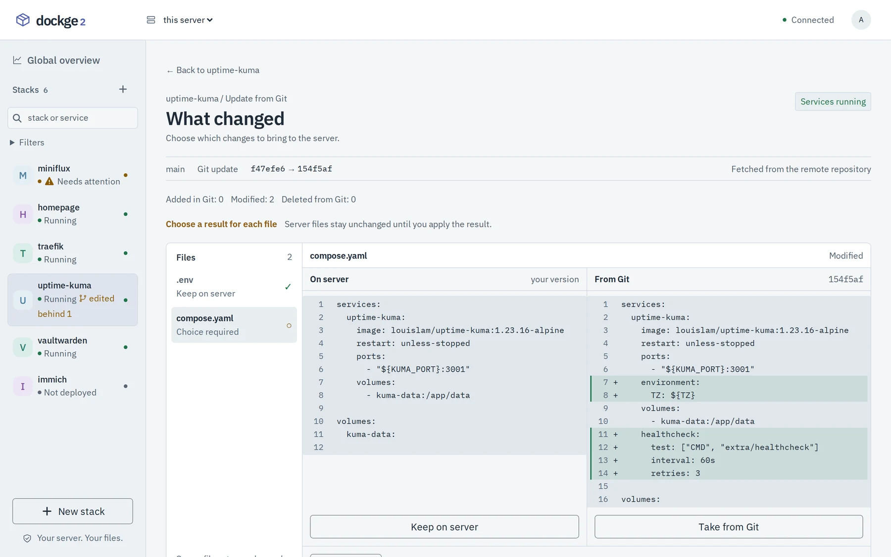

# Stacks from Git

A stack directory can be a Git checkout. The panel clones it, tells you how far behind its branch
the server copy is, and applies an update file by file, with you choosing each result.

## Deploy a stack from a repository

1. New stack -> From Git. Enter the repository address and the branch; "List branches" asks the
   repository for them.
2. Review and launch. Name the Compose file, or leave it empty to detect `compose.yaml`,
   `compose.yml`, `docker-compose.yaml` or `docker-compose.yml` at the repository root.
3. Deploy, or save without starting to adjust the environment in the stack files first. The
   repository is cloned and Compose is validated before anything starts.

The address is HTTP(S), `ssh://` or `git@host:path`, with no password or token in it.

A repository often leaves its env file out of Git and carries an example instead, such as
`.env.example` next to a service with `env_file: .env`. Such a stack is saved but not started, and
the result names the file to create and its example. "Create .env from .env.example" copies the
example with `0600` permissions and opens the stack's files: replace the example's values with your
own and start the stack. The same goes for a variable the Compose file requires and nothing sets.
An update applied with "Apply and deploy" behaves the same way: the chosen files are written, and
the stack is not started until its environment is filled in.

## Update a stack

When the branch moves ahead, the stack shows "behind" with the number of commits, and "edited" when
files on the server differ from Git. "Compare changes" opens the comparison:



1. Every changed file is listed as added in Git, modified or deleted from Git, and shown side by
   side: "On server" and "From Git". Files that may hold secrets, such as `.env`, and binary files
   are compared without showing their contents.
2. For each file choose "Keep on server" or "Take from Git", or edit the result by hand. The draft
   stays in memory, and server files stay unchanged until you apply the result.
3. "Apply and deploy" validates Compose with the selected files, re-checks that the server files
   have not changed since the comparison, writes the result, pulls images and recreates the changed
   services. Saving without deploying is also possible.
4. The result shows what actually happened. A local version you kept keeps showing as different
   from Git.

Comments and formatting of the files are preserved, and nothing is pushed to the repository. A
comparison stays valid for 10 minutes; after that, or when the files changed meanwhile, the panel
asks for a new one.

## What is supported

- Fast-forward updates of one branch. Diverged branches are not merged.
- Regular files, with Compose and env files at the repository root. No submodules and no symlinks.
- Up to 1000 files, 1 MB per file and 20 MB in total.
- No implicit `reset --hard`, `clean` or stash. When a write fails, the original files are restored;
  after a crash in the middle of a write, the originals are in `.git/dockge-recovery-*` in the stack
  directory.
- Rolling files back does not roll container data back.

## Private repositories

The panel talks to Git directly, never to the GitHub API, and authenticates with an SSH key only:

- No prompt is ever shown (`GIT_TERMINAL_PROMPT=0`), credential helpers are disabled and the global
  Git configuration is ignored. A command that would ask for a password fails instead of hanging.
- A token inside the repository address is rejected, so a secret cannot end up in the
  configuration, a list or a log.

### A deploy key from the panel

Use the SSH address of the repository, such as `git@github.com:owner/repository.git`. Under the
address on the New stack page the panel offers **Create a deploy key**. It generates an ed25519 key
on the server and shows the public line and its fingerprint, with a link to the page where GitHub,
GitLab or Bitbucket adds it. Add it there as a deploy key with read access only, then load the
branches.

- The key belongs to the repository, not to the stack: two stacks of one repository use the same
  key, and it is found however the address is typed (with or without `.git`).
- The private half is kept in the data directory, `git-keys/`, with `0600` permissions, and never
  leaves the server. The panel never replaces an existing key: the repository already trusts it.
- The key is used for that repository only; the server's own keys and an SSH agent are not offered
  alongside it.
- When an existing stack loses access, the update check says so and shows the key again.
- Deleting a stack leaves the key in place. Remove the file from `git-keys/` and the deploy key from
  the repository when the repository is no longer used.

The host keys of github.com, gitlab.com and bitbucket.org ship with the panel. For another host,
add its key to `known_hosts` in a mounted `/root/.ssh`; otherwise the panel reports that it does
not know the host rather than trusting whatever answers.

### A key of your own

An SSH key without a passphrase, plus a `known_hosts` entry for the Git host, can also be mounted
into the panel container at `/root/.ssh`. The mount is set on
[installation](installation.md#ssh-keys-registry-logins-and-certificates). A deploy key created in
the panel takes precedence over it for its repository.

Without a key a private repository does not half work: the clone fails, and the panel says that the
repository did not let the server in.

## From the command line

A stack that is a Git checkout can also be updated from the host, with a command inside the panel
container. It fast-forwards the branch, validates Compose with the files named explicitly, pulls
the images and starts the stack, waiting up to 60 seconds for its health checks:

```bash
sudo docker exec dockge2-dockge-1 npm run deploy-stack -- --stack=my-stack --dry-run
sudo docker exec dockge2-dockge-1 npm run deploy-stack -- --stack=my-stack \
  --file=compose.yaml --env-file=.env --env-file=.env.production
```

| Option | Meaning |
| --- | --- |
| `--stack=NAME` | Stack directory inside the stacks directory, required |
| `--file=FILE` | Compose file, `compose.yaml` by default |
| `--env-file=FILE` | Env file for interpolation, repeatable, in order |
| `--branch=NAME` | Branch to fast-forward to, `main` by default |
| `--stacks-dir=DIR` | Stacks directory, `DOCKGE_STACKS_DIR` by default |
| `--skip-git` | Deploy a stack that is not a checkout |
| `--force-recreate` | Recreate the containers even without changes |
| `--dry-run` | Print the commands without running them |

It stops when the stack directory has local changes and never runs `git reset` or `git clean`.
It is an administrative command for the host; the browser has no event that runs arbitrary Git.
