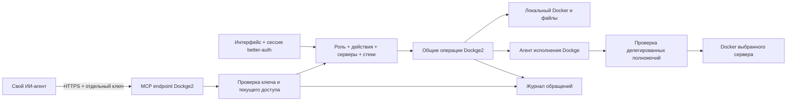

# Dockge2: MCP для своих ИИ-агентов и доступ по ключам

Дата: 2026-09-11. Реализация добавлена в рабочую копию; MCP выключен по умолчанию. Ниже сохранен исходный контракт и этапы приемки. Фактический API, ограничения и проверенные клиенты описаны в `docs/mcp.md`; изменяющие действия вызываются через `operation_prepare` / `operation_apply`, а не отдельными одноименными MCP-инструментами.

## Результат для пользователя

Владелец открывает "Настройки -> Доступ ИИ / MCP", создает отдельный ключ для своего ИИ-агента, выбирает роль, серверы и стеки, срок действия. Подключенный агент видит состояние контейнеров и выполняет только разрешенные операции. Наблюдатель не может остановить контейнер, изменить Compose, развернуть стек или выполнить команду, даже если напрямую сформирует запрещенный запрос.

"Напрямую" означает вызовы инструментов Dockge2 через MCP без работы мышью в интерфейсе. Docker socket, произвольные команды Docker и shell внешнему агенту не выдаются. Внешний ИИ-агент и агент исполнения Dockge на другом сервере - разные сущности, их нужно различать в интерфейсе и именах API.

## Что уже есть и что потребуется

- `backend/auth-access.ts`: роли admin/operator/viewer, разрешенные Socket.IO события, повторная проверка сессии и роли, безопасная сводка `viewerStackSummary`.
- Наблюдатель сейчас ограничен `requestStackList`, `serviceStatusList`, `stackAvailability`, `stabilityOverview`; доступа к файлам, журналам, секретам и терминалу нет. MCP не должен расширять этот контракт автоматически.
- `backend/agent-manager.ts` и `backend/socket-handlers/agent-proxy-socket-handler.ts`: маршрутизация на локальный и удаленные серверы, с проверкой перед отправкой. Эти пути сейчас связаны с браузерным socket/cookie.
- `backend/stack.ts`, `backend/stack-git.ts`, `backend/stability.ts`: операции и наблюдения, которые нужно переиспользовать через общий служебный слой.
- Уже имеющийся better-auth обслуживает пользователей. Сам по себе он не создает машинные ключи и не заменяет проверку полномочий MCP.
- В master-plan уже записан переход межсерверного доступа с паролей на ограниченные ключи/mTLS. Этот план добавляет внешний MCP и согласует его с тем переходом; это не одна и та же задача.

## Архитектура

MCP - дополнительный транспорт. Не создавать фальшивую пользовательскую сессию, не вызывать браузерные обработчики с подставным Socket и не дублировать операции Docker в MCP-адаптере.

Предлагаемый контекст вызова: тип субъекта (`user`/`api_key`), ID ключа, ответственный пользователь, текущая роль, разрешенные операции, набор серверов и стеков, версия политики. Эффективные права - пересечение текущих прав ответственного пользователя, потолка роли ключа, явно выданных действий, ресурсов и прав соединения с сервером исполнения. Повышение роли пользователя не повышает старый ключ; понижение или блокировка сразу ограничивает дальнейшие запросы ключа.

Первый выпуск: профиль "Наблюдатель" по умолчанию и профиль "Оператор" с отдельными разрешениями. Владельцу доступны управление ключами и журнал через обычный интерфейс. Администрирование пользователей, выдача новых ключей и повышение собственных прав через MCP не предоставляются.

## Матрица возможностей первого выпуска

Таблица описывает возможности. Названия изменяющих действий используются внутри `operation_prepare`; список реальных инструментов возвращает `tools/list`. Поддержка ограничена управляемыми стеками, включая отдельно зарезервированные имена для клонирования. Во всех строках обязательны ограничения серверов/стеков.

| Возможность / инструменты | Наблюдатель | Оператор | Дополнительное условие |
| --- | --- | --- | --- |
| `servers_list`, `stacks_list` | Да | Да | Только доступные объекты; без адресов с credentials |
| `containers_list`, `container_status` | Да | Да | Белый список полей; не сырой docker inspect |
| `stability_get` | Да | Да | Состояние, здоровье, uptime, перезапуски, подтвержденная история |
| `container_logs` | Нет | При разрешении `logs:read` | Ограничить строки/период/байты; журналы могут содержать секреты |
| `container_start`, `container_stop`, `container_restart` | Нет | При `containers:control` | Проверить принадлежность контейнера разрешенному стеку непосредственно перед действием |
| `stack_start`, `stack_stop`, `stack_restart` | Нет | При `stacks:control` | Явный сервер и стек; без неявного применения ко всем |
| `stack_files_read`, `stack_files_write` | Нет | При отдельных `files:read/write` | Только разрешенные файлы стека, проверка исходного хеша, сохранность текста |
| `git_preview`, `git_apply` | Нет | При `git:read/apply` | Preview делает fetch, поэтому не является чистым чтением; apply привязан к субъекту и состоянию файлов |
| `stack_deploy`, `stack_images_update`, `git_clone` | Нет | При отдельном `deploy` | Доверенный оператор хоста; выбранные сервер/путь/репозиторий и явное подтверждение операции |
| `operation_status` | Только безопасные сводки разрешенных операций | Да, в пределах доступа | По ID нельзя прочитать чужой результат или секретный stderr |
| shell, exec, произвольный Docker/Git, Docker socket | Нет | Нет в первом выпуске | Это обход ограничений; не включать универсальный инструмент команд |
| Удаление стеков/томов, prune, down -v, управление пользователями/ключами | Нет | Нет в первом выпуске | Сохранить в существующих административных сценариях, не расширять MCP автоматически |

Контейнеры вне управляемых стеков: допустимо наблюдение в пределах разрешенного сервера. Изменения для них по умолчанию запрещены; расширение потребует отдельного явно выданного доступа. Для записей сервер сопоставляет `server_id + container_id` с реальным стеком, а не доверяет переданному клиентом имени/label. Если нет стабильного ID стека, добавить внутренний ID в метаданные; удаление и повторное создание под прежним именем не должно наследовать старый доступ неявно.

Оператор, которому разрешены Compose-развертывание и изменение файлов, остается доверенным пользователем Docker-хоста. Такие права не обеспечивают изоляцию хоста: Compose способен запросить привилегии и монтирования. Ограничение ключа несколькими стеками не следует называть песочницей. Наблюдатель не получает эти возможности ни при каких дополнительных флагах.

## Ключи и их жизненный цикл

- Отдельный ключ на каждое подключение ИИ, а не один общий ключ сервера и не пароль пользователя.
- Случайный секрет не менее 32 байт; публичный ID/префикс для поиска и хеш секрета в базе. Исходный ключ показывается один раз; не хранится в открытом виде, логах, URL, аналитике или снимках.
- Предлагаемая запись `api_keys`: ID, название, ответственный пользователь, хеш, роль-потолок, набор действий, серверы/стеки, created_at, expires_at, revoked_at, last_used_at, policy_version. Связи ресурсов предпочтительнее свободной строки с произвольным URL.
- По умолчанию срок 30 дней и роль наблюдателя. Владелец может выбрать иной ограниченный срок; ключ без срока не является значением по умолчанию.
- Выдача, изменение доступа и отзыв только владельцем через защищенный better-auth интерфейс; дополнительная проверка для чувствительного управления доступом. Открытая регистрация не появляется.
- Отозвать, перевыпустить, уменьшить доступ; при перевыпуске создается новый секрет, срок перекрытия со старым задается явно. Нельзя просто повторно показать старый секрет.
- Перед каждым запросом и перед фактическим началом отложенной операции заново проверять срок, отзыв, статус ответственного пользователя и текущие ограничения. Не полагаться на роль, закешированную при соединении.
- Отзыв прекращает новые запросы и ожидающие операции; уже выполненный побочный эффект не откатывается автоматически. Долгие операции получают проверяемые точки отмены и честный итог: отменено/выполнено/результат неизвестен.
- Запретить ключу авторизоваться в браузерных административных API. Ключ MCP также не превращается в credentials удаленного Docker/Git.

## Проверка прав и границ данных

1. MCP всегда требует отдельный ключ, в том числе при отключенной браузерной аутентификации в локальном режиме. Не наследовать обход проверки пользователя из такого режима. До разбора прикладной операции проверить ключ и ограничения размера запроса. Нет ключа, неверный, истекший или отозванный ключ -> отказ в аутентификации.
2. `tools/list` возвращает только допустимые инструменты. Это удобство, а не защита: `tools/call` повторно проверяет доступ независимо от того, что ранее видел клиент.
3. Проверка выполняется до любой операции Docker, файловой записи, fetch или отправки удаленному серверу. Неизвестные имена инструментов и действия запрещены по умолчанию.
4. `resources/list/read`, подсказки, подписки, страницы выдачи и результаты операций обязаны использовать ту же политику. Не оставлять вспомогательный метод, раскрывающий закрытые данные.
5. Нельзя принять из JSON роль, ID чужого владельца, флаг admin, произвольный endpoint, путь или аргументы shell как доверенное полномочие. Схемы строгие, неожиданные поля отклоняются.
6. Отдельные безопасные модели ответа наблюдателя: без env, mounts, credentials, содержимого файлов, полных labels и секретного stderr. Редактирование строк/маскирование не считается достаточной защитой сырого inspect или журналов.
7. Для нескольких серверов сначала разрешить каждый объект. Wildcard-запись "на все" не поддерживается в первом выпуске; страницы списка и события также фильтруются.
8. Не пересылать внешний ключ удаленному серверу. Использовать отдельное машинное соединение с проверяемым делегированным контекстом: субъект, действие, целевой сервер/стек, срок, ID запроса; проверка на стороне исполнения. Привилегированная сессия управляющего сервера не должна повышать права исходного наблюдателя.
9. Preview/operation ID принадлежит конкретному ключу и объекту, имеет срок и хеш параметров; чужой ID, изменение параметров, отзыв ключа или смена файлов делают применение недопустимым.
10. Ограничения частоты, параллельных вызовов, объема ответа, периода журналов и времени Docker-запроса действуют также для наблюдателя. Отсутствие права записи не исключает перегрузку сервера чтением.
11. Журналы, README и Compose из репозитория считаются данными, а не инструкциями изменить политику доступа. Никакой текст, возвращенный инструментом, не разрешает новый сервер или действие.

## Изменяющие операции и повторные запросы

Чтение состояния может выполняться сразу. Для операций с последствиями предлагать `prepare -> apply`: сервер возвращает точный объект, действие, затрагиваемые сервисы и хеш; применение использует ограниченный по времени ID. Этот механизм защищает от изменившихся параметров, но сам по себе не подтверждает участие человека: ИИ способен вызвать оба инструмента.

Владелец выбирает режим ключа: только чтение; разрешенные операции автоматически; либо операции требуют подтверждения владельцем в интерфейсе Dockge2. В последнем режиме одобрение может выдать только обычная сессия пользователя с подходящей ролью. MCP-ключ не может подтвердить собственный запрос. Одобрение одноразовое, привязано к ключу, параметрам и сроку; повторная проверка доступа обязательна после одобрения.

Идемпотентность записей: привязка request_id к ключу, операции, объекту и хешу параметров. Повтор не запускает второй restart/deploy. При разрыве связи клиент проверяет `operation_status`, а не слепо повторяет команду. Для Git раздельно возвращать сохранение файлов и развертывание; откат файлов не означает откат данных контейнера.

## Транспорт и совместимость

Предлагается HTTPS endpoint `/mcp` со Streamable HTTP. Ключ передается только в `Authorization: Bearer <key>`, не в URL и не в аргументах инструмента. Не включать MCP автоматически при запуске; владелец явно включает доступ. Проверять Origin, Host, разрешенные адреса и настройки обратного прокси; отсутствие Origin у машинного клиента не означает отсутствие проверки ключа.

Проверена спецификация MCP 2026-07-28: авторизация HTTP описывает OAuth 2.1, а Streamable HTTP изменился относительно 2025-11-25, включая отказ от протокольных сессий и GET-потока. Поэтому нельзя взять старый пример SDK и объявить поддержку всех современных клиентов. До реализации закрепить версии SDK/протокола и выполнить проверку совместимости. [Авторизация](https://modelcontextprotocol.io/specification/2026-07-28/basic/authorization), [Streamable HTTP](https://modelcontextprotocol.io/specification/2026-07-28/basic/transports/streamable-http).

Первый режим - собственные ограниченные ключи для клиентов, умеющих задавать Bearer-заголовок. Это не заявление о полной реализации стандартного OAuth-процесса MCP. Для клиентов, требующих OAuth/discovery, отдельный этап: авторизация через существующие закрытые учетные записи с OAuth 2.1, без публичной регистрации. Если нужен stdio-клиент, небольшой локальный адаптер получает ключ из окружения и обращается к тому же защищенному endpoint; не обходит политику прямым доступом к Docker.

Аннотации `readOnlyHint`/`destructiveHint` заполняются верно, но не являются разграничением прав. Защита находится в серверной политике и проверяется отрицательными тестами. [Спецификация инструментов](https://modelcontextprotocol.io/specification/2026-07-28/server/tools).

## Интерфейс без усложнения основной панели

Внутри настроек владельца: "Доступ ИИ / MCP". На странице - состояние сервера, адрес подключения, список ключей с названием, ролью, ресурсами, сроком и последним использованием. Кнопка "Создать ключ" открывает краткую форму; подробные разрешения раскрываются только для оператора. Перед выдачей видно словами, что агент сможет делать.

После создания - однократный показ секрета и пример подключения с адресом и переменной окружения. В сохраненном примере секрет заменяется заполнителем. Отдельно доступны отзыв и журнал обращений. Никаких ключей в диффах, общих настройках, экспортируемых снимках или URL.

Журнал: время, ID ключа, инструмент, сервер/стек/контейнер, разрешено/отказано, итог, длительность и request_id. Не сохранять тело Compose, env, токены, командный вывод и ответы журналов. Предлагаемый срок хранения метаданных 30 дней с настраиваемым ограничением объема. Наблюдатель не получает общий журнал всех пользователей.

## Этапы и приемка

| Этап | Работа | Зависимости | Условие завершения |
| --- | --- | --- | --- |
| M0 | Контракт инструментов, выбор SDK/версии, проверка клиента с Bearer, пределы ресурсов | Нет | Подтвержденный запрос к тестовому MCP; таблица совместимости, без доступа к реальному Docker |
| M1 | Общий контекст доступа и служебный слой операций | M0 | UI и MCP используют одну политику; существующие тесты ролей/Compose сохранены |
| M2 | Хранение, выдача, отзыв и страница ключей | M1 | Секрет один раз, хеш в БД, отзыв/истечение/блокировка пользователя проверены |
| M3 | MCP наблюдателя на локальном сервере | M2 | Списки/статусы/uptime работают; каждый путь записи дает отказ без побочного эффекта |
| M4 | Делегирование на серверы исполнения | M3 | Два настоящих изолированных сервера; ключ одного стека не видит/не меняет другой; внешний ключ не пересылается |
| M5 | Оператор, структурированные действия, журнал, подтверждения и идемпотентность | M4 | Разрешенное действие работает ровно один раз; отказ/отзыв/смена параметров не приводят к запуску |
| M6 | Git/файлы/развертывание с отдельными разрешениями | M5, UI A4 для ручного результата | Проверены сохранность текста, привязка preview, устаревание и раздельные результаты save/deploy |
| M7 | Совместимость выбранных внешних клиентов, при необходимости OAuth/stdio | M3-M6 | Документация описывает только реально проверенные способы подключения |

Порядок UI и MCP: сначала общий визуальный каркас A0-A2; M0 можно исследовать отдельно, M1-M4 не требуют нового постоянного раздела в рабочей области. Возможности записи не выпускать до приемки наблюдателя и межсерверного ограничения.

## Обязательные отрицательные тесты

- [x] Наблюдатель напрямую вызывает каждый изменяющий инструмент, включая скрытый из `tools/list`: отказ, Docker/файлы/Git/удаленная отправка не вызываются.
- [x] Наблюдатель передает лишний `role=admin`, произвольное имя события, endpoint, container_id, путь, shell-строку: отказ по схеме/политике.
- [x] Ключ для одного сервера/стека подставляет другой объект, ресурс, страницу списка, preview или operation ID: нет доступа и утечки содержимого.
- [x] Истекший/отозванный ключ, заблокированный ответственный пользователь и пониженная роль: отказ также в существующем соединении и перед выполнением из очереди.
- [x] Подписка/длительный ответ после отзыва прекращает выдавать новые данные. Идемпотентный повтор после отзыва не возвращает закрытые данные из кеша.
- [x] Административные credentials межсерверного соединения не повышают полномочия внешнего ключа; проверено на двух серверах.
- [x] Ошибка Docker, некорректный Compose, журнал с секретом и сырой inspect не раскрываются наблюдателю.
- [x] Повтор request_id с теми же параметрами не повторяет действие; с другими параметрами отклоняется. Сбой сети не превращается в повторный deploy.
- [x] Изменившийся файл/контейнер между проверкой и применением отклоняется; выбранные байты Compose сохраняются.
- [x] Подтверждение операции нельзя подделать через MCP, использовать дважды или перенести на другие параметры/ключ.
- [x] Неверный Origin/Host, слишком большой запрос, частые/параллельные вызовы и неизвестный инструмент корректно ограничиваются.
- [x] Тесты наблюдателя проверяют не только код ошибки, но и отсутствие побочных эффектов и закрытых полей ответа.

Перед выпуском: lint, TypeScript, модульные проверки доступа и файлов, сборка, изолированные Docker и браузерные проверки управления ключами, реальный MCP-клиент и два сервера. Результаты выполненных проверок приведены в конце документа; развертывание в рабочее окружение отдельно от локальной приемки.

## Приемка реализации 2026-09-11

- M0: официальный SDK 1.30.0, согласованный протокол 2025-11-25, Bearer и stateless Streamable HTTP проверены настоящим клиентом. Совместимость с другими клиентами не заявляется.
- M1-M3: единая серверная проверка, индивидуальные хешированные ключи, роли, точные пары сервер/стек, срок/отзыв/сокращение прав и безопасные наблюдения реализованы. Перед возвратом чтения сравниваются действующие полномочия, включая изменение роли и области во время запроса.
- M4: два настоящих изолированных процесса Dockge, подписанные Ed25519 запросы и текущая проверка на обеих сторонах. Внешний ключ не пересылается; соседний стек и лишнее действие недоступны.
- M5: структурированные действия, owner review, однократное подтверждение, идемпотентность и журнал. Реальный restart в тестовом Docker-проекте происходит один раз; после аварии неизвестный результат не превращается в повтор.
- M6: настоящий HTTP Git: reserve/clone, fetch/preview, edited apply сохраняют точные байты. Подготовка не записывает рабочие файлы. Проверяются исходный хеш, выбранное дерево и входы Compose перед развертыванием; сохранение и запуск возвращаются отдельно.
- M7: документация и пример проверенного SDK-клиента готовы. OAuth/discovery, stdio и отдельные настольные клиенты остаются за границами этого выпуска.

Проверки: `npm run check` - 311/311, покрытие строк 80,33%, ветвей 82,73%, функций 87,36%; `npm run test:docker-integration` - 9/9; основной UI - 17 E2E, управление ключом MCP - 1 E2E. TypeScript, lint и сборка прошли. В пределах HTTP проверены неправильные Host/Origin, размер запроса, 60 запросов в минуту и четыре одновременных запроса. Долгих подписок в этом транспорте нет; соответствующий отрицательный сценарий проверяет отзыв/сокращение прав во время незавершенного чтения.

Управление ключами проверено через браузер: включение, выдача наблюдателя на один стек, однократный показ секрета, закрытие/перезагрузка без повторного раскрытия и отзыв. Следы браузера, видео и снимки этого теста отключены, секрет не выводится в журнал. Реальный рабочий сервер не обновлялся; тестовые проекты и процессы очищены.
